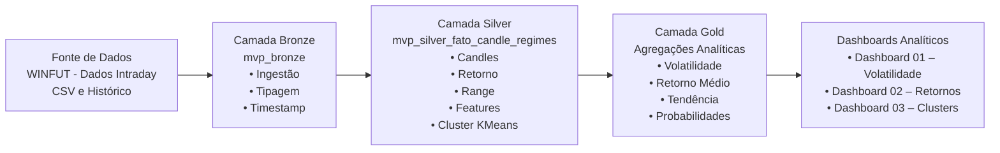

```mermaid
flowchart LR
    A[Fonte de Dados<br/>WINFUT - Dados Intraday<br/>CSV e Histórico] --> B

    B[Camada Bronze<br/>mvp_bronze<br/>• Ingestão<br/>• Tipagem<br/>• Timestamp] --> C

    C[Camada Silver<br/>mvp_silver_fato_candle_regimes<br/>• Candles<br/>• Retorno<br/>• Range<br/>• Features<br/>• Cluster KMeans] --> D

    D[Camada Gold<br/>Agregações Analíticas<br/>• Volatilidade<br/>• Retorno Médio<br/>• Tendência<br/>• Probabilidades] --> E

    E[Dashboards Analíticos<br/>• Dashboard 01 – Volatilidade<br/>• Dashboard 02 – Retornos<br/>• Dashboard 03 – Clusters]
```
