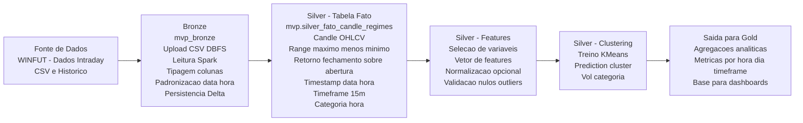

```mermaid
flowchart LR

A[Fonte de Dados<br/>WINFUT - Dados Intraday<br/>CSV e Historico] --> B

B[Bronze<br/>mvp_bronze<br/>Upload CSV DBFS<br/>Leitura Spark<br/>Tipagem colunas<br/>Padronizacao data hora<br/>Persistencia Delta] --> C

C[Silver - Tabela Fato<br/>mvp.silver_fato_candle_regimes<br/>Candle OHLCV<br/>Range maximo menos minimo<br/>Retorno fechamento sobre abertura<br/>Timestamp data hora<br/>Timeframe 15m<br/>Categoria hora] --> D

D[Silver - Features<br/>Selecao de variaveis<br/>Vetor de features<br/>Normalizacao opcional<br/>Validacao nulos outliers] --> E

E[Silver - Clustering<br/>Treino KMeans<br/>Prediction cluster<br/>Vol categoria] --> F

F[Saida para Gold<br/>Agregacoes analiticas<br/>Metricas por hora dia timeframe<br/>Base para dashboards]

```

