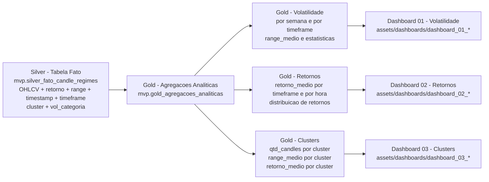

```mermaid
flowchart LR

A[Silver - Tabela Fato<br/>mvp.silver_fato_candle_regimes<br/>OHLCV + retorno + range + timestamp + timeframe<br/>cluster + vol_categoria] --> B[Gold - Agregacoes Analiticas<br/>mvp.gold_agregacoes_analiticas]

B --> C[Gold - Volatilidade<br/>por semana e por timeframe<br/>range_medio e estatisticas]
B --> D[Gold - Retornos<br/>retorno_medio por timeframe e por hora<br/>distribuicao de retornos]
B --> E[Gold - Clusters<br/>qtd_candles por cluster<br/>range_medio por cluster<br/>retorno_medio por cluster]

C --> F[Dashboard 01 - Volatilidade<br/>assets/dashboards/dashboard_01_*]
D --> G[Dashboard 02 - Retornos<br/>assets/dashboards/dashboard_02_*]
E --> H[Dashboard 03 - Clusters<br/>assets/dashboards/dashboard_03_*]
```
