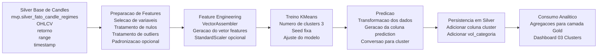

```mermaid
flowchart LR

A[Silver Base de Candles
mvp.silver_fato_candle_regimes
OHLCV
retorno
range
timestamp]
--> B[Preparacao de Features
Selecao de variaveis
Tratamento de nulos
Tratamento de outliers
Padronizacao opcional]

B --> C[Feature Engineering
VectorAssembler
Geracao do vetor features
StandardScaler opcional]

C --> D[Treino KMeans
Numero de clusters 3
Seed fixa
Ajuste do modelo]

D --> E[Predicao
Transformacao dos dados
Geracao da coluna prediction
Conversao para cluster]

E --> F[Persistencia em Silver
Adicionar coluna cluster
Adicionar vol_categoria]

F --> G[Consumo Analitico
Agregacoes para camada Gold
Dashboard 03 Clusters]

```
