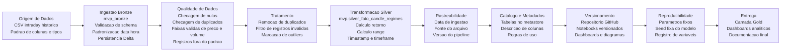

```mermaid
flowchart LR

A[Origem de Dados
CSV intraday historico
Padrao de colunas e tipos]
--> B[Ingestao Bronze
mvp_bronze
Validacao de schema
Padronizacao data hora
Persistencia Delta]

B --> C[Qualidade de Dados
Checagem de nulos
Checagem de duplicados
Faixas validas de preco e volume
Registros fora do padrao]

C --> D[Tratamento
Remocao de duplicados
Filtro de registros invalidos
Marcacao de outliers]

D --> E[Transformacao Silver
mvp.silver_fato_candle_regimes
Calculo retorno
Calculo range
Timestamp e timeframe]

E --> F[Rastreabilidade
Data de ingestao
Fonte do arquivo
Versao do pipeline]

F --> G[Catalogo e Metadados
Tabelas no metastore
Descricao de colunas
Regras de uso]

G --> H[Versionamento
Repositorio GitHub
Notebooks versionados
Dashboards e diagramas]

H --> I[Reprodutibilidade
Parametros fixos
Seed fixa do modelo
Registro de variaveis]

I --> J[Entrega
Camada Gold
Dashboards analiticos
Documentacao final]

```
Evidencias no GitHub
Documentacao no README]
